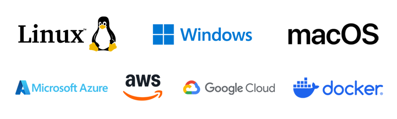
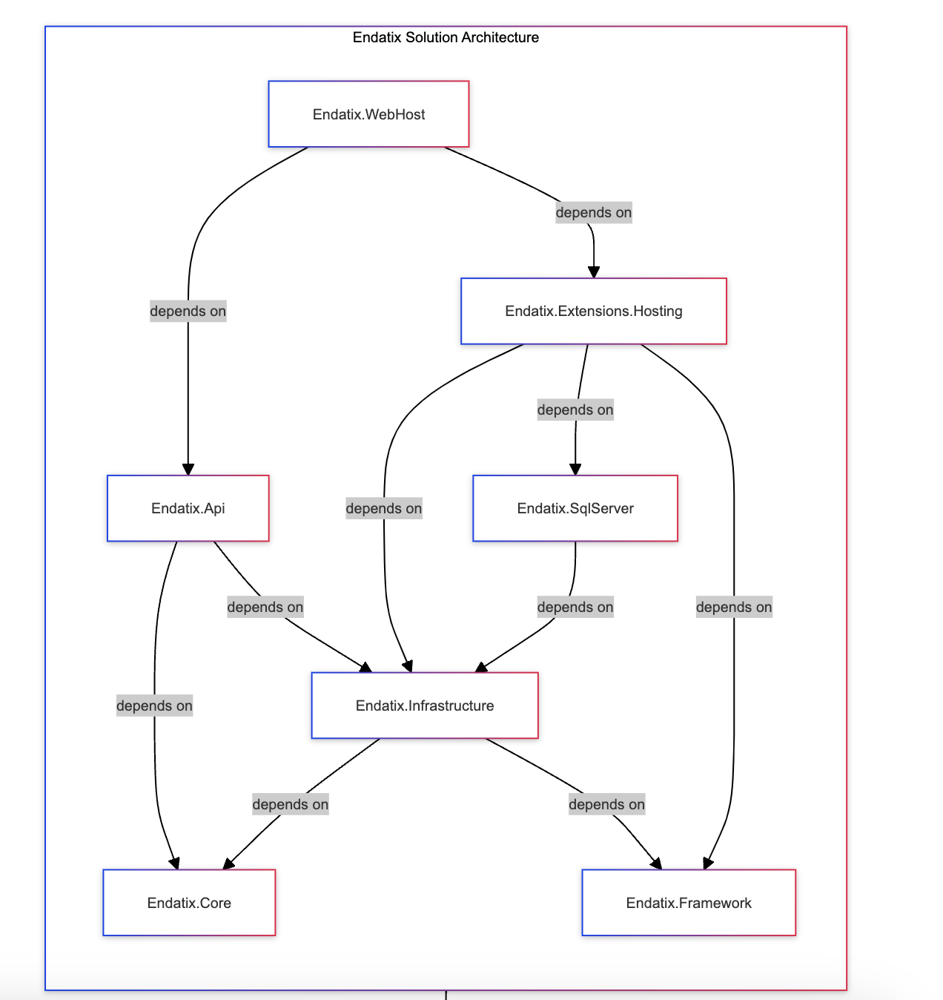

# Endatix Platform

[](https://github.com/endatix/endatix/actions/workflows/build-ci.yml)
[](https://github.com/endatix/endatix/actions/workflows/release.yml)
[](https://coveralls.io/github/endatix/endatix?branch=main)

## What is Endatix?

Endatix is a free form management backend API designed to integrate with the [SurveyJS](https://github.com/surveyjs/survey-library) frontend library.

It provides REST API endpoints for CRUD operations and the management of forms, templates, submissions, themes, custom form fields, and more. It can be used to build self-hosted or SaaS solutions that focus on collecting information from [humans](https://en.wikipedia.org/wiki/Human) in industries such as market research, legal, insurance, finance, education, healthcare, and more.

This API project is the core of the [Endatix Hub](https://endatix.com) form management system for business users, offering a complete UI, seamless integration with the [SurveyJS Creator](https://github.com/surveyjs/survey-creator) form-building tool, and an [AI assistant](https://www.youtube.com/watch?v=aX_Hm4WYsEE).

## Table of Contents
- [Features](#features)
- [Tech Stack](#requirements)
- [Supported Environments](#supported-environments)
- [Installation](#installation)
- [Usage](#usage)
- [Form Management Database Schema](#form-management-database-schema)
- [Codebase Organization and Dependencies](#codebase-organization-and-dependencies)
- [Software Design Approach](#software-design-approach)
- [License](#license)
- [Contact and Resources](#contact-and-resources)

## Features

* **Form Versioning** (Allows a form to be modified after it has started collecting submissions)
* **Form Access Control** (Forms can be publically accessible or password-protected) 
* **Form Lifecycle Management** (draft vs. published state)
* **Form Templates**
* **Themes** (Based on SurveyJS [Themes and Styles](https://surveyjs.io/form-library/documentation/manage-default-themes-and-styles))
* **Partial Submissions** (Users can resume incomplete submissions)
* **Prefilled forms**
* **Submission metadata** (Including completion status, date/time started, and date/time completed)
* **Webhooks** (Support for *submission completed*, *form created*, *form updated*, and *form deleted* events)
* **reCAPTCHA support**
* **Email Notifications** (Sendgrid and Mailgun connectors)
* **Database-stored Custom Question Types** (SurveyJS [specialized](https://surveyjs.io/form-library/documentation/customize-question-types/create-specialized-question-types) or [composite](https://surveyjs.io/form-library/documentation/customize-question-types/create-composite-question-types) custom question code can be added at runtime)
* **Multitenancy** (ORM-enforced tenant isolation)
* **Basic Authentication**
* **Role Based Access Control**
* **Single-Sign-On** (Supports Keycloak and other [OAuth 2.0](https://oauth.net/2/) implementations)

## Tech Stack

* .NET 10.0 (formerly .NET Core)
* Entity Framework Core
* PostgreSQL, MS SQL, or Azure SQL

## Supported Environments

<br>

Endatix runs on any server or workstation that supports [.NET 10.0 (formerly .NET Core)](https://dotnet.microsoft.com/en-us/download/dotnet/10.0), including **Linux**, **Windows**, and **macOS**.

It can be deployed to on-premise servers, cloud environments such as **Azure**, **AWS**, or **Google Cloud**, and also runs in [**Docker Containers**](https://hub.docker.com/u/endatix) for simplified setup and scaling.

## Installation

To set up the Endatix API ensure you have [.NET 10.0 SDK or Runtime (formerly .NET Core)](https://dotnet.microsoft.com/en-us/download/dotnet/10.0) installed and follow these steps:

```bash
# Clone the repository
git clone https://github.com/endatix/endatix.git

# Navigate to the project directory
cd endatix

# Build the project
dotnet build
```

## Usage

The following React example provides a very basic demonstration of loading a SurveyJS form and saving a submission through the Endatix API. For a complete API reference and implementation guides visit our [documentation portal](https://docs.endatix.com).

```TypeScript
import React, { useEffect, useState } from "react";
import { Model } from 'survey-core'
import { Survey } from 'survey-react-ui'
import 'survey-core/survey-core.css'

export default function App() {
  const [survey, setSurvey] = useState(null);

  useEffect(() => {
    fetch("/api/forms/123456789/definition") // <-- Fetch form with id = 123456789
      .then(res => res.json())
      .then(data => {
        const json = JSON.parse(data.jsonData); // <-- Extract the SurveyJS form JSON
        const surveyModel = new Model(json);

        surveyModel.onComplete.add((sender) => { 
          fetch("/api/forms/123456789/submissions", { // <-- Create a new submission record
            method: "POST",
            headers: { "Content-Type": "application/json" },
            body: JSON.stringify({
              isComplete: true,
              currentPage: 0,
              jsonData: JSON.stringify(sender.data), // <-- Set the SurveyJS submission JSON
              metadata: "{}",
              reCaptchaToken: ""
            })
          })
          .then(res => res.json())
          .then(resp => console.log("Submission response:", resp))
          .catch(err => console.error("Submission error:", err));
        });

        setSurvey(surveyModel);
      });
  }, []);

  if (!survey) return <div>Loading...</div>;

  return <Survey model={survey} />;
}
```

## Form Management Database Schema


## Codebase Organization and Dependencies

The code base consists of .NET projects having the following brief descriptions and internal dependencies:

* **Endatix.Api** - the web API endpoints. Depends on Endatix.Core and Endatix.Infrastructure
* **Endatix.Core** - the core application domain - entities, aggregate roots, domain events, use case and etc.. No dependencies
* **Endatix.Framework** - core framework project to expose common customization and extensibility points. To be used by all modules. No dependencies
* **Endatix.Extensions.Hosting** - Easy to use utilities for web hosting Endatix. Depends on Endatix.Framework, Endatix.Infrastructure & Endatix.SqlServer
* **Endatix.Infrastructure** - main implementations of the Core project. Deals with 3rd party integrations. Depends on Endatix.Core & Endatix.Framework
* **Endatix.SqlServer**   - implementation of MS SQL specific database logic. Depends on Endatix.Infrastructure
* **Endatix.WebHost**  - default app host project. Has zero code. Shows how endatix can be hosted and is used for debugging and testing the application. Depends on Endatix.Extensions.Hosting & Endatix.Api



## Software Design Approach

- **Clean Architecture**: Enforces separation of concerns and dependency rules
- **Domain-Driven Design**: Supports rich domain models and business logic
- **Vertical Slice Architecture**: Organizes code by feature rather than technical concerns
- **API Configuration**: Simplified setup for RESTful APIs with versioning, Swagger, and CORS
- **Persistence**: Streamlined database configuration for SQL Server and PostgreSQL
- **Security**: Built-in JWT authentication and authorization
- **Logging**: Structured logging with Serilog
- **Health Checks**: Comprehensive health monitoring for applications and dependencies
- **Middleware**: Exception handling, request logging, and more

## License

This project is licensed under the MIT License - see the [LICENSE](LICENSE) file for details.

## Contact and Resources

For questions, issues, or contributions, you can reach out through the following channels:
- **GitHub Issues**: [Open an issue](https://github.com/endatix/endatix/issues) on our GitHub repository for bug reports, feature requests, or general inquiries.
- **Email**: Drop us a line at  [info@endatix.com](mailto:info@endatix.com) to directly contact our team if you prefer.
- **Endatix Website**: https://endatix.com
- **Official Documentation**: https://docs.endatix.com

We recommend using GitHub Issues for public inquiries, bug reports, and feature requests, as it allows others to see and participate in the discussion. Email can be used for more private or specific queries.