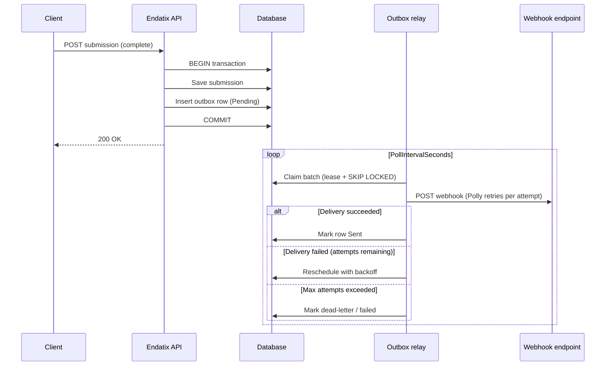

# Background Processing

Endatix decouples **fast API responses** from **slow or unreliable side effects** (webhook HTTP calls, future integrations). When a domain event occurs—such as a completed submission—the API persists your data and schedules background work in the same database transaction. A background relay then delivers that work reliably.

This page explains the **transactional outbox pattern**, how Endatix applies it today, and how to configure the in-process relay via `Endatix:Outbox` in `appsettings.json`.

## Why Background Processing?

Without background processing, every side effect runs inside the HTTP request:

- Webhook delivery waits on external HTTP latency and retries.
- A slow or failing endpoint can delay—or even fail—the API response after your data was already saved.
- Work is lost if the process crashes mid-request.

Endatix avoids that by **enqueueing durable work** when domain state is committed, then processing it asynchronously.

## The Transactional Outbox Pattern

The [transactional outbox pattern](https://microservices.io/patterns/data/transactional-outbox.html) solves a simple problem: *how do you atomically save business data **and** schedule background work?*

Instead of calling a message broker or HTTP endpoint directly from the request handler, Endatix writes an **outbox row** in the **same database transaction** as the domain change. A separate **relay** process later reads pending rows and performs the side effect.

Benefits for self-hosted and multi-instance deployments:

| Benefit | How Endatix achieves it |
|---------|-------------------------|
| **Atomicity** | The outbox row is written in the same database transaction as your form and submission data — either both are saved or neither is. |
| **Durability** | Rows survive process restarts; nothing is held only in memory. |
| **Safe scale-out** | Multiple API instances can run relays; `SKIP LOCKED` / lease-based claiming prevents double-processing. |
| **Retries** | Failed deliveries are rescheduled with exponential backoff; permanent failures move to a dead-letter state. |
| **At-least-once delivery** | Replays are expected; webhook receivers should treat `X-Endatix-Hook-Id` as an idempotency key. |

### Endatix Outbox Flow



At a high level:

1. **Capture** — When a domain event occurs (for example, a submission is completed), Endatix appends an outbox message (event type, JSON payload, tenant) in the **same database transaction** that saves your data. This happens automatically — no extra configuration or code is involved.
2. **Claim** — The relay (a background service named `OutboxRelayBackgroundService` — you will see it in the logs) polls the outbox table and claims rows with a time-bounded lease.
3. **Publish** — The relay maps each message to the matching webhook operation and delivers it through your configured webhook endpoints.
4. **Complete** — Successful delivery marks the row **Sent**; failures reschedule until `MaxAttempts`.

The relay engine itself lives in the [`Endatix.Outbox.Engine`](https://github.com/endatix/endatix-relay) package (published as [NuGet `Endatix.Outbox.Engine`](https://www.nuget.org/packages/Endatix.Outbox.Engine)). Endatix consumes that package and supplies Endatix-specific publishing (webhooks) and EF schema mapping.

## In-Process Relay (Default)

By default, the outbox relay runs **inside your API host** as a hosted background service. No separate worker container is required for single-instance or moderate deployments.

```json
"Endatix": {
  "Outbox": {
    "RunInProcess": true
  }
}
```

Under the hood, `RunInProcess` seeds the OpenFeature feature flag `outbox-relay-in-process`, which the relay re-evaluates every poll cycle. Today the flag value comes from configuration read **at startup**, so changing `RunInProcess` requires an application restart to take effect. When a dynamic OpenFeature provider (for example, flagd) is plugged in later, the flag will be flippable at runtime — that is the planned cutover switch to a standalone relay worker.

:::tip[Prerequisite]
The outbox table must exist before the relay can run. Enable [automatic migrations](/docs/configuration/settings/data-settings) (`Endatix:Data:EnableAutoMigrations`) or apply migrations manually as part of your deployment process.
:::

### What Gets Delivered Today?

These integration events flow through the outbox. The `EventType` column is what you will see in the `OutboxMessages` table; each maps to the corresponding webhook event from the [Webhooks guide](/docs/guides/webhooks):

| Outbox `EventType` | Webhook event | Raised when |
|--------------------|---------------|-------------|
| `form.created` | `FormCreated` | A form is created |
| `form.updated` | `FormUpdated` | A form is updated |
| `form.enabled_state_changed` | `FormEnabledStateChanged` | A form's enabled state changes |
| `form.deleted` | `FormDeleted` | A form is deleted |
| `submission.completed` | `SubmissionCompleted` | A submission is completed |

Delivery uses the same webhook configuration described in the [Webhooks guide](/docs/guides/webhooks): tenant- or form-level endpoints, API key auth, and Polly-based HTTP resilience.

The outbox row `Id` is reused as the webhook `X-Endatix-Hook-Id` header so retries and duplicate deliveries are safe for idempotent receivers.

## Configuration Reference

Add or customize the `Endatix:Outbox` section in `appsettings.json`. All settings are optional — omitting the section (or individual keys) uses the defaults below:

```json
"Endatix": {
  "Outbox": {
    "RunInProcess": true,
    "PollIntervalSeconds": 5,
    "BatchSize": 50,
    "LeaseSeconds": 60,
    "MaxAttempts": 8,
    "BackoffBaseSeconds": 5,
    "BackoffCapSeconds": 300
  }
}
```

| Setting | Description | Default |
|---------|-------------|---------|
| `RunInProcess` | When `true`, the API host runs the outbox relay loop. When `false`, the in-process relay is disabled so an external relay worker can take over (see the warning below). | `true` |
| `PollIntervalSeconds` | How often the relay polls for pending outbox messages. Lower values reduce latency; higher values reduce database load. | `5` |
| `BatchSize` | Maximum number of messages claimed per poll cycle. | `50` |
| `LeaseSeconds` | Duration a claimed row is locked to this relay instance. If the worker crashes, the lease expires and another instance can reclaim the row. | `60` |
| `MaxAttempts` | Maximum delivery attempts before the message is treated as permanently failed (dead-letter). | `8` |
| `BackoffBaseSeconds` | Base delay for exponential backoff between retries. | `5` |
| `BackoffCapSeconds` | Upper bound on retry delay (seconds). | `300` |

:::warning[Do not disable the relay without a replacement]
Do not set `RunInProcess` to `false` unless you are running your own relay worker against the same database. No standalone worker is currently published — with the in-process relay off, outbox messages accumulate as **Pending** and webhooks are silently never delivered (no errors are raised anywhere).
:::

:::note[Environment-specific tuning]
Use `appsettings.Production.json` for production values. For example, you might increase `PollIntervalSeconds` on large databases or tighten `MaxAttempts` when endpoints are known to be best-effort.
:::

## Separate-Process Relay (Planned)

A standalone relay worker — a separate process or container that claims outbox rows from the same database and publishes them via a message broker (for example, Dapr pub/sub) — is **planned but not yet available**. It targets multi-instance scale-out and cross-service fan-out; typical self-hosted single-node deployments will not need it.

The relay engine is already built to support this: the [`Endatix.Outbox.Engine`](https://github.com/endatix/endatix-relay) package is host-agnostic, and the same claiming/lease mechanics will power both the in-process relay and the future worker. When the worker ships, the cutover will be: deploy the worker against the same database, then set `RunInProcess` to `false` on API instances.

Until then, keep `RunInProcess` set to `true` (see the warning above). Follow the [`endatix-relay`](https://github.com/endatix/endatix-relay) repository for availability.

## Operations

### Verifying Delivery

The `OutboxMessages` table is the ground truth for background delivery. Each row's `Status` column tells you where it is in the pipeline:

| `Status` | Meaning |
|----------|---------|
| `0` (Pending) | Captured, waiting for the relay to deliver it (check `NextAttemptAt` and `Attempts` if it stays here). |
| `1` (Sent) | Delivered successfully. |
| `2` (Failed) | Gave up after `MaxAttempts` — requires operator attention. |

A quick backlog check:

```sql
SELECT "Status", COUNT(*) FROM "OutboxMessages" GROUP BY "Status";
```

The relay also emits structured logs (message id, event type, attempt, next retry time) — look for the `OutboxRelayBackgroundService` log source. So if a webhook did not arrive, one query tells you whether the event was never captured (no row), is still retrying (Pending with growing `Attempts`), or was dead-lettered (Failed) — which separates a relay problem from a receiving-endpoint problem.

### Failure Handling

When webhook delivery fails, expect:

- **HTTP-level retries** for each delivery attempt (Polly resilience pipeline—configurable under `Endatix:WebHooks`).
- **Outbox-level retries** with backoff until `MaxAttempts` is reached.

Monitor backlog growth if endpoints are down for extended periods. Guidance on triaging and replaying **Failed** messages will be added in a future release.

## Related Documentation

- [Webhooks](/docs/guides/webhooks) — configure endpoints, authentication, and event types.
- [Data settings](/docs/configuration/settings/data-settings) — migrations and seeding prerequisites.
- [Configuration fundamentals](/docs/configuration/) — `appsettings.json` conventions under the `Endatix` root key.
- [Endatix.Outbox.Engine (GitHub)](https://github.com/endatix/endatix-relay) — relay package source, contracts, and release notes.
