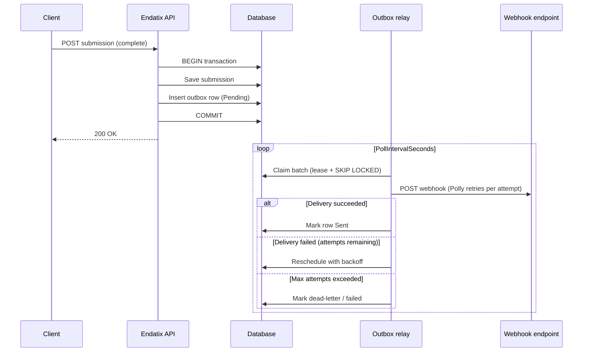

# Background Processing

Endatix decouples **fast API responses** from **slow or unreliable side effects** (webhook HTTP calls, future integrations). When a domain event occurs—such as a completed submission—the API persists your data and schedules background work in the same database transaction. A background relay then delivers that work reliably.

This page explains the **transactional outbox pattern**, how Endatix applies it today, and how to configure the in-process relay via `Endatix:Outbox` in `appsettings.json`.

## Why background processing?

Without background processing, every side effect runs inside the HTTP request:

- Webhook delivery waits on external HTTP latency and retries.
- A slow or failing endpoint can delay—or even fail—the API response after your data was already saved.
- Work is lost if the process crashes mid-request.

Endatix avoids that by **enqueueing durable work** when domain state is committed, then processing it asynchronously.

## The transactional outbox pattern

The [transactional outbox pattern](https://microservices.io/patterns/data/transactional-outbox.html) solves a simple problem: *how do you atomically save business data **and** schedule background work?*

Instead of calling a message broker or HTTP endpoint directly from the request handler, Endatix writes an **outbox row** in the **same database transaction** as the domain change. A separate **relay** process later reads pending rows and performs the side effect.

Benefits for self-hosted and multi-instance deployments:

| Benefit | How Endatix achieves it |
|---------|-------------------------|
| **Atomicity** | Outbox insert shares the EF `SaveChanges` transaction with forms, submissions, etc. |
| **Durability** | Rows survive process restarts; nothing is held only in memory. |
| **Safe scale-out** | Multiple API instances can run relays; `SKIP LOCKED` / lease-based claiming prevents double-processing. |
| **Retries** | Failed deliveries are rescheduled with exponential backoff; permanent failures move to a dead-letter state. |
| **At-least-once delivery** | Replays are expected; webhook receivers should treat `X-Endatix-Hook-Id` as an idempotency key. |

### Endatix outbox flow



At a high level:

1. **Capture** — Domain handlers persist state and append an outbox message (`EventType`, JSON `Payload`, `TenantId`).
2. **Claim** — `OutboxRelayBackgroundService` polls the outbox table, claims rows with a time-bounded lease.
3. **Publish** — Endatix wires `IIntegrationEventPublisher` to webhook delivery (`WebHookIntegrationEventPublisher` → `DeliverWebHookAsync`).
4. **Complete** — Successful delivery marks the row **Sent**; failures reschedule until `MaxAttempts`.

The relay engine itself lives in the [`Endatix.Outbox.Engine`](https://github.com/endatix/endatix-relay) package (published as [NuGet `Endatix.Outbox.Engine`](https://www.nuget.org/packages/Endatix.Outbox.Engine)). Endatix consumes that package and supplies Endatix-specific publishing (webhooks) and EF schema mapping.

## In-process relay (default)

By default, the outbox relay runs **inside your API host** as a hosted background service (`OutboxRelayBackgroundService`). No separate worker container is required for single-instance or moderate deployments.

```json
"Endatix": {
  "Outbox": {
    "RunInProcess": true
  }
}
```

When `RunInProcess` is `true`, Endatix seeds the OpenFeature flag `outbox-relay-in-process` to **on**. The relay evaluates that flag every poll cycle—flipping it off (via configuration or a future external OpenFeature provider) hands processing to a standalone worker without redeploying the API.

:::tip[Prerequisite]
The outbox table must exist before the relay can run. Enable [automatic migrations](/docs/configuration/settings/data-settings) (`Endatix:Data:EnableAutoMigrations`) or apply migrations manually as part of your deployment process.
:::

### What gets delivered today?

The in-process publisher maps outbox `EventType` values to built-in webhook operations—for example `submission.completed` → `SubmissionCompleted`. Delivery uses the same webhook configuration described in the [Webhooks guide](/docs/guides/webhooks): tenant- or form-level endpoints, API key auth, and Polly-based HTTP resilience.

The outbox row `Id` is reused as the webhook `X-Endatix-Hook-Id` header so retries and duplicate deliveries are safe for idempotent receivers.

## Configuration reference

Add or customize the `Endatix:Outbox` section in `appsettings.json` (shipped in `Endatix.WebHost`):

```json
"Endatix": {
  "Outbox": {
    "RunInProcess": true,
    "PollIntervalSeconds": 5,
    "BatchSize": 50,
    "LeaseSeconds": 60,
    "MaxAttempts": 8,
    "BackoffBaseSeconds": 5,
    "BackoffCapSeconds": 300
  }
}
```

| Setting | Description | Default (sample) |
|---------|-------------|------------------|
| `RunInProcess` | When `true`, the API host runs the outbox relay loop. When `false`, the in-process relay is disabled via OpenFeature so a **standalone worker** can claim rows instead. | `true` |
| `PollIntervalSeconds` | How often the relay polls for pending outbox messages. Lower values reduce latency; higher values reduce database load. | `5` |
| `BatchSize` | Maximum number of messages claimed per poll cycle. | `50` |
| `LeaseSeconds` | Duration a claimed row is locked to this relay instance. If the worker crashes, the lease expires and another instance can reclaim the row. | `60` |
| `MaxAttempts` | Maximum delivery attempts before the message is treated as permanently failed (dead-letter). | `8` |
| `BackoffBaseSeconds` | Base delay for exponential backoff between retries. | `5` |
| `BackoffCapSeconds` | Upper bound on retry delay (seconds). | `300` |

:::note[Environment-specific tuning]
Use `appsettings.Production.json` for production values. For example, you might increase `PollIntervalSeconds` on large databases or tighten `MaxAttempts` when endpoints are known to be best-effort.
:::

## Separate-process relay (future / advanced)

The [`endatix-relay`](https://github.com/endatix/endatix-relay) repository hosts **`Endatix.Outbox.Engine`**—an Endatix-agnostic relay package used by both:

- **In-process** — Endatix API (`RunInProcess: true`, webhook publisher registered in Infrastructure).
- **Standalone worker** — A separate process or container that shares the same database and claim store but publishes via a different `IIntegrationEventPublisher` (for example Dapr pub/sub in a future scale-out topology).

To run a standalone worker:

1. Set `Endatix:Outbox:RunInProcess` to `false` on API instances (disables the in-process loop).
2. Deploy a worker that references `Endatix.Outbox.Engine`, registers `AddSqlOutboxClaimStore` against the **same** database, and supplies its own publisher implementation.
3. Ensure both hosts agree on the outbox table name and schema ([`OutboxSchema` contract](https://github.com/endatix/endatix-relay)).

This path is intended for **multi-instance scale-out** and cross-service fan-out. It is not required for typical self-hosted single-node deployments.

## Operations

When webhook delivery fails, expect:

- **HTTP-level retries** inside `WebHookServer` (Polly resilience pipeline—configurable under `Endatix:WebHooks`).
- **Outbox-level retries** with backoff until `MaxAttempts` is reached.
- **Structured logs** from the relay and webhook layers (message id, event type, attempt, next retry time).

Monitor backlog growth if endpoints are down for extended periods. A dedicated runbook for dead-letter triage and manual replay is planned as part of the broader async-messaging platform work.

## Related documentation

- [Webhooks](/docs/guides/webhooks) — configure endpoints, authentication, and event types.
- [Data settings](/docs/configuration/settings/data-settings) — migrations and seeding prerequisites.
- [Configuration fundamentals](/docs/configuration/) — `appsettings.json` conventions under the `Endatix` root key.
- [Endatix.Outbox.Engine (GitHub)](https://github.com/endatix/endatix-relay) — relay package source, contracts, and release notes.
