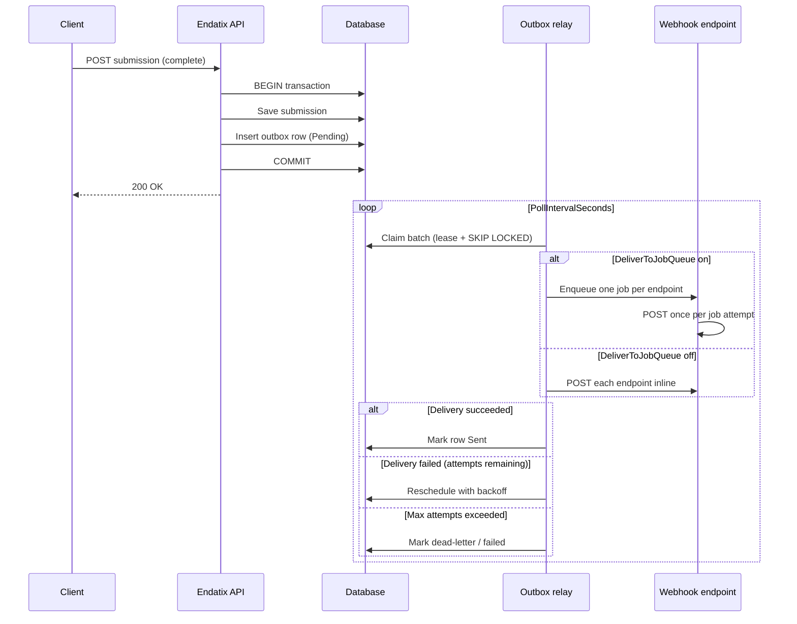

# Background Processing

Endatix decouples **fast API responses** from **slow or unreliable side effects** (webhook HTTP calls, future integrations). When a domain event occurs, such as a completed submission, the API persists your data and schedules background work in the same database transaction. A background relay then delivers that work reliably.

This page explains the **transactional outbox pattern**, how Endatix applies it today, and how to configure the in-process relay via `Endatix:Outbox` in `appsettings.json`.

## Why Background Processing?

Without background processing, every side effect runs inside the HTTP request:

- Webhook delivery waits on external HTTP latency and retries.
- A slow or failing endpoint can delay, or even fail, the API response after your data was already saved.
- Work is lost if the process crashes mid-request.

Endatix avoids that by **enqueueing durable work** when domain state is committed, then processing it asynchronously.

## The Transactional Outbox Pattern

The [transactional outbox pattern](https://microservices.io/patterns/data/transactional-outbox.html) solves a simple problem: *how do you atomically save business data **and** schedule background work?*

Instead of calling a message broker or HTTP endpoint directly from the request handler, Endatix writes an **outbox row** in the **same database transaction** as the domain change. A separate **relay** process later reads pending rows and performs the side effect.

Benefits for self-hosted and multi-instance deployments:

| Benefit | How Endatix achieves it |
|---------|-------------------------|
| **Atomicity** | The outbox row is written in the same database transaction as your form and submission data - either both are saved or neither is. |
| **Durability** | Rows survive process restarts; nothing is held only in memory. |
| **Safe scale-out** | Multiple API instances can run relays; `SKIP LOCKED` / lease-based claiming prevents double-processing. |
| **Retries** | Failed deliveries are rescheduled with exponential backoff; permanent failures move to a dead-letter state. |
| **At-least-once delivery** | Replays are expected; webhook receivers should treat `X-Endatix-Hook-Id` as an idempotency key. |

### Endatix Outbox Flow


```mermaid
sequenceDiagram
    participant Client
    participant API as Endatix API
    participant DB as Database
    participant Relay as Outbox relay
    participant WH as Webhook endpoint

    Client->>API: POST submission (complete)
    API->>DB: BEGIN transaction
    API->>DB: Save submission
    API->>DB: Insert outbox row (Pending)
    API->>DB: COMMIT
    API-->>Client: 200 OK

    loop PollIntervalSeconds
        Relay->>DB: Claim batch (lease + SKIP LOCKED)
        alt DeliverToJobQueue on
            Relay->>WH: Enqueue one job per endpoint
            WH->>WH: POST once per job attempt
        else DeliverToJobQueue off
            Relay->>WH: POST each endpoint inline
        end
        alt Delivery succeeded
            Relay->>DB: Mark row Sent
        else Delivery failed (attempts remaining)
            Relay->>DB: Reschedule with backoff
        else Max attempts exceeded
            Relay->>DB: Mark dead-letter / failed
        end
    end
```

At a high level:

1. **Capture** - When a domain event occurs (for example, a submission is completed), Endatix appends an outbox message (event type, JSON payload, tenant) in the **same database transaction** that saves your data. This happens automatically - no extra configuration or code is involved.
2. **Claim** - The relay (a background service named `OutboxRelayBackgroundService` - you will see it in the logs) polls the outbox table and claims rows with a time-bounded lease.
3. **Publish** - By default the relay runs every registered outbox subscriber (`IOutboxIntegrationEventHandler`) itself: webhooks, reporting flattening, and future modules. All matched handlers must succeed before the row is marked **Sent**. With [delivery to the job queue](#delivery-to-the-job-queue) on, it enqueues one background job per subscriber instead and marks the row **Sent** as soon as they are enqueued.
4. **Complete** - Successful delivery marks the row **Sent**; failures reschedule until `MaxAttempts`.

The relay engine itself lives in the [`Endatix.Outbox.Engine`](https://github.com/endatix/endatix-relay) package (published as [NuGet `Endatix.Outbox.Engine`](https://www.nuget.org/packages/Endatix.Outbox.Engine)). Endatix consumes that package and supplies Endatix-specific subscribers (webhooks, reporting) and EF schema mapping.

### Outbox subscribers

The relay resolves a single `IIntegrationEventPublisher` that delegates to all `IOutboxIntegrationEventHandler` registrations whose `EventTypes` include the message `EventType`. Multiple handlers can subscribe to the same event (for example, `submission.completed` triggers webhook delivery and BI flattening).

Durable integration events (webhooks, reporting) are driven by the outbox relay. Slack notifications for `submission.completed` still use MediatR after `SaveChanges` (planned migration to outbox in a follow-up).

### React to a screen-out

`submission.collection_status_changed` is an outbox event. `INotificationHandler<SubmissionCollectionStatusChangedEvent>` does not run. The MediatR sample in `samples/Endatix.Samples.CustomEventHandlers` handles `SubmissionCompletedEvent` only.

To run code in the API host when a submission is screened out:

1. Implement `IOutboxIntegrationEventHandler` (`Endatix.Outbox.Engine`). Set `EventTypes` to `SubmissionCollectionStatusChangedEvent.EventTypeName` (`submission.collection_status_changed`).
2. Read `message.Payload`. It is camelCase JSON. Long ids are strings. `collectionStatus` is `screen_out` and `previousCollectionStatus` is the status before it, such as `in_progress`. `isComplete` is `false`. Answers are in `jsonData`.
3. Register it on the API host: `builder.Services.AddScoped<IOutboxIntegrationEventHandler, ScreenOutHandler>()`.
4. Keep the in-process relay on (`Endatix:Outbox:RunInProcess`). The handler runs after the submission transaction commits. A throw fails the outbox delivery and the relay retries it.

```csharp
using System.Text.Json;
using Endatix.Core.Events;
using Endatix.Outbox.Engine;

public sealed class ScreenOutHandler : IOutboxIntegrationEventHandler
{
    public IReadOnlyCollection<string> EventTypes { get; } =
        [SubmissionCollectionStatusChangedEvent.EventTypeName];

    public Task HandleAsync(IOutboxMessage message, CancellationToken cancellationToken)
    {
        using JsonDocument document = JsonDocument.Parse(message.Payload);
        string? submissionId = document.RootElement.GetProperty("submissionId").GetString();
        string? status = document.RootElement.GetProperty("collectionStatus").GetString();
        // status is "screen_out"
        return Task.CompletedTask;
    }
}
```

A system outside the API process uses the [webhook](/docs/guides/webhooks) `SubmissionCollectionStatusChanged` instead of this handler.

## In-Process Relay (Default)

By default, the outbox relay runs **inside your API host** as a hosted background service. No separate worker container is required for single-instance or moderate deployments.

```json
"Endatix": {
  "Outbox": {
    "RunInProcess": true
  }
}
```

Under the hood, `RunInProcess` seeds the OpenFeature feature flag `outbox-relay-in-process`, which the relay re-evaluates every poll cycle. Today the flag value comes from configuration read **at startup**, so changing `RunInProcess` requires an application restart to take effect. When a dynamic OpenFeature provider (for example, flagd) is plugged in later, the flag will be flippable at runtime - that is the planned cutover switch to a standalone relay worker.

:::tip[Prerequisite]
The outbox table must exist before the relay can run. Enable [automatic migrations](/docs/configuration/settings/data-settings) (`Endatix:Data:EnableAutoMigrations`) or apply migrations manually as part of your deployment process.
:::

### What Gets Delivered Today?

These integration events flow through the outbox. The `EventType` column is what you will see in the `OutboxMessages` table:

| Outbox `EventType` | Webhook event | Raised when | Other subscribers |
|--------------------|---------------|-------------|-------------------|
| `form.created` | `FormCreated` | A form is created | - |
| `form.updated` | `FormUpdated` | A form is updated | - |
| `form.enabled_state_changed` | `FormEnabledStateChanged` | A form's enabled state changes | - |
| `form.deleted` | `FormDeleted` | A form is deleted | - |
| `form.definition.updated` | - | Active form definition schema changes or a new active definition is published | Reporting: compile export schema |
| `submission.completed` | `SubmissionCompleted` | A submission is completed (first time) | Reporting: flatten |
| `submission.collection_status_changed` | `SubmissionCollectionStatusChanged` | A submission is screened out (`screen_out`, `IsComplete` stays false) | - |
| `submission.updated` | - | A completed submission's answers, metadata, definition, or submitter identity change | Reporting: re-flatten when answers or definition change |
| `submission.deleted` | - | A submission is deleted | Reporting: sync flattened row deletion |

Webhook-mapped events use the same webhook configuration described in the [Webhooks guide](/docs/guides/webhooks): tenant- or form-level endpoints and API key auth. `DeliverToJobQueue` defaults to `false`. Turn it on to deliver each endpoint as its own background job (`Endatix:BackgroundJobs:JobTypes:WebHookDelivery`). Duplicate URLs in one event collapse to one job. A URL that changes after the job is queued ends that job without a call.

The outbox row `Id` is reused as the webhook `X-Endatix-Hook-Id` header so retries and duplicate deliveries are safe for idempotent receivers.

## Configuration Reference

Add or customize the `Endatix:Outbox` section in `appsettings.json`. All settings are optional - omitting the section (or individual keys) uses the defaults below:

```json
"Endatix": {
  "Outbox": {
    "RunInProcess": true,
    "DeliverToJobQueue": false,
    "PollIntervalSeconds": 5,
    "BatchSize": 50,
    "LeaseSeconds": 60,
    "MaxAttempts": 8,
    "BackoffBaseSeconds": 5,
    "BackoffCapSeconds": 300
  }
}
```

| Setting | Description | Default |
|---------|-------------|---------|
| `RunInProcess` | When `true`, the API host runs the outbox relay loop. When `false`, the in-process relay is disabled so an external relay worker can take over (see the warning below). | `true` |
| `DeliverToJobQueue` | When `true`, the relay delivers each message by enqueuing one background job per subscriber instead of running the subscribers itself. Read at startup. See [Delivery to the job queue](#delivery-to-the-job-queue). | `false` |
| `PollIntervalSeconds` | How often the relay polls for pending outbox messages. Lower values reduce latency; higher values reduce database load. | `5` |
| `BatchSize` | Maximum number of messages claimed per poll cycle. | `50` |
| `LeaseSeconds` | Duration a claimed row is locked to this relay instance. If the worker crashes, the lease expires and another instance can reclaim the row. | `60` |
| `MaxAttempts` | Maximum delivery attempts before the message is treated as permanently failed (dead-letter). | `8` |
| `BackoffBaseSeconds` | Base delay for exponential backoff between retries. | `5` |
| `BackoffCapSeconds` | Upper bound on retry delay (seconds). | `300` |

:::warning[Do not disable the relay without a replacement]
Do not set `RunInProcess` to `false` unless you are running your own relay worker against the same database. No standalone worker is currently published - with the in-process relay off, outbox messages accumulate as **Pending** and webhooks are silently never delivered (no errors are raised anywhere).
:::

:::note[Environment-specific tuning]
Use `appsettings.Production.json` for production values. For example, you might increase `PollIntervalSeconds` on large databases or tighten `MaxAttempts` when endpoints are known to be best-effort.
:::

## Background jobs

Background jobs run work that outlives a request — one webhook delivery, one Reporting update — each with its own retries and status. They are provided by the Jobs module, which is **PostgreSQL only** and off unless `Endatix:FeatureFlags:JobsModule` is `true`.

Each job is a row in `jobs."BackgroundJobs"`, the record `GET jobs/{jobId}` reads, plus one trigger in [Quartz.NET](https://www.quartz-scheduler.net/) 4.2's clustered store in the same `jobs` schema. Enqueueing writes both in one transaction. Quartz decides when and on which node a job runs, and runs a stopped node's jobs again on another node. The job's row alone decides whether a failed attempt is retried or dead-lettered; each retry is a new trigger for the job, at the time its backoff sets. The `jobs` migrations create Quartz's tables; with automatic migrations off, apply them before you start the API, or startup fails with `Database schema validation failed under table prefix 'jobs.qrtz_'`.

### Deployment profiles

Every host that registers the Jobs module can enqueue. `Endatix:BackgroundJobs:RunInProcess` decides whether it also **executes** jobs:

- **One process** — keep `RunInProcess` at `true`. The API enqueues and runs jobs.
- **API and workers** — set `RunInProcess` to `false` on API instances and `true` on worker instances of the same image, all against the same database. API instances only enqueue; workers pick jobs up within `IdleWaitTimeSeconds`.

Each job type is capped per node (`JobTypes:{JobType}:MaxConcurrency`, which defaults to the job type's [built-in value](#built-in-job-type-defaults)), so a webhook backlog never takes a Reporting or export slot. A node never runs a job type it has no handler for; the job waits for a node that has it. Jobs recovered from a stopped node count against their type's cap like any other.

:::warning[Nodes' clocks must agree]
Every node sharing the database must keep its clock within **1 second** of the others. A node judges a peer dead by comparing timestamps; a node whose clock runs behind can be presumed dead while it is healthy, and its running jobs run a second time. The first run is stopped within `CancellationPollSeconds` of the second starting, and records nothing.
:::

## Delivery to the job queue

With `Endatix:Outbox:DeliverToJobQueue` set to `true`, the relay stops running subscribers inside its loop. For each message it enqueues **one background job per subscriber** — one per distinct enabled endpoint URL, one per Reporting handler — and marks the message **Sent**. A failing webhook endpoint then retries and dead-letters on its own, without re-sending to the healthy endpoints or holding up Reporting.

- **Requires the Jobs module.** `Endatix:Outbox:DeliverToJobQueue` requires PostgreSQL, because the Jobs module does. On SQL Server it must stay `false`. If the switch is on and the Jobs module is not registered, the relay pauses — messages stay **Pending** — and logs `The outbox relay is paused: Endatix:Outbox:DeliverToJobQueue is on but the Jobs module is not registered.`
- **Every subscriber needs a job subscription.** Startup fails when an outbox handler handles an event its module has no job subscription for, naming the handler and the event. Custom modules and SaaS modules keep the switch off until every one of their inline handlers has a subscription.
- **Relay hosts register every subscribing module.** Every host that runs the outbox relay must register every module that subscribes to outbox events, with the same module feature flags. A relay host without a module marks that module's events **Sent** without enqueuing its jobs, and nothing can detect it.
- **Webhook attempts.** Each webhook job POSTs once per attempt, with no HTTP-level retries, so an endpoint receives at most `JobTypes:WebHookDelivery:MaxAttempts` requests for one event: 8, its built-in default, on every host. The general `MaxAttempts` changes that only on a host that sets it. `X-Endatix-Hook-Id` is still the outbox message id.
- **Redelivery is safe.** A message delivered twice — after a crash between enqueueing and marking it sent — enqueues nothing new: each job carries the dedup key `{outboxMessageId}:{subscriber}`.

:::note[Release note]
Webhooks delivered through the job queue retry and dead-letter **per endpoint**: one failing endpoint no longer causes re-delivery to the others.
:::

## Background jobs configuration reference

All keys are under `Endatix:BackgroundJobs`. Per-job-type values go under `JobTypes:{JobType}`.

**Anything set in configuration wins over code.** Each per-job-type setting is looked up on its own, and the first of these that has a value is used:

1. the job type's own key, `Endatix:BackgroundJobs:JobTypes:{JobType}:{Setting}`;
2. the general key, `Endatix:BackgroundJobs:{Setting}`, if the host set it — even to its default value;
3. the job type's [built-in default](#built-in-job-type-defaults), declared in code;
4. the general built-in default, listed with each key below.

`MaxConcurrency` has no general key, so it takes the job type's own key, then the job type's built-in default, then `1`.

For example, a host whose `appsettings.json` has

```json
"Endatix": {
  "BackgroundJobs": {
    "RetentionDays": 30,
    "JobTypes": {
      "WebHookDelivery": { "MaxAttempts": 10 }
    }
  }
}
```

keeps every finished job's row for 30 days, webhook deliveries included, and tries a webhook delivery 10 times; the other webhook settings keep their built-in defaults. The same with environment variables:

```bash
Endatix__BackgroundJobs__RetentionDays=30
Endatix__BackgroundJobs__JobTypes__WebHookDelivery__MaxAttempts=10
```

<Settings>
<Setting name="Endatix:BackgroundJobs:RunInProcess" default="true">
Whether this host executes jobs. `false` makes it enqueue only — its scheduler has no threads and never starts.
</Setting>
<Setting name="Endatix:BackgroundJobs:IdleWaitTimeSeconds" default="2">
How long an idle node waits before looking for jobs another node enqueued.
</Setting>
<Setting name="Endatix:BackgroundJobs:CancellationPollSeconds" default="10">
How often a running job re-reads its row to notice it was cancelled.
</Setting>
<Setting name="Endatix:BackgroundJobs:MisfireThresholdSeconds" default="60">
How long a due job may wait for a free slot before `endatix.jobs.misfired` counts it, again at every threshold while it waits. The backlog warning `Background job {JobId} of type {JobType} waited past the misfire threshold; {Misfires} triggers of this type misfired since the last warning.` is logged at most once per job type per threshold.
</Setting>
<Setting name="Endatix:BackgroundJobs:ShutdownWaitSeconds" default="30">
How long a stopping host waits for running jobs. Jobs still running then record nothing and run again on the next node. The host's own shutdown timeout (`HostOptions.ShutdownTimeout`, 30 seconds by default) also bounds this wait, so a longer value needs a longer host timeout.
</Setting>
<Setting name="Endatix:BackgroundJobs:MaxRuntimeMinutes" default="60">
Ceiling on one attempt; the handler's token is cancelled when it passes. Per job type. A host that sets this key replaces every job type's built-in default, even when it sets it to `60`; a job type's own key still wins.
</Setting>
<Setting name="Endatix:BackgroundJobs:MaxAttempts" default="3">
Attempts before a job that keeps failing is dead-lettered. Per job type. A job whose node stops during its last attempt is dead-lettered when another node recovers it, rather than run again. The value is read when an attempt ends, so a change also applies to jobs already waiting to retry. A job still on a trigger stored by an earlier version, whose own retries run out before the job finishes, is taken over and logged as `The scheduler ran out of retries for background job …`. A host that sets this key replaces every job type's built-in default, even when it sets it to `3`; a job type's own key still wins.
</Setting>
<Setting name="Endatix:BackgroundJobs:BackoffBaseSeconds" default="30">
Wait before the first retry; each later retry waits twice as long. Per job type. A host that sets this key replaces every job type's built-in default, even when it sets it to `30`; a job type's own key still wins.
</Setting>
<Setting name="Endatix:BackgroundJobs:BackoffCapSeconds" default="900">
Longest wait between retries. Per job type. A host that sets this key replaces every job type's built-in default, even when it sets it to `900`; a job type's own key still wins.
</Setting>
<Setting name="Endatix:BackgroundJobs:RetentionDays" default="7">
Days a finished job's row is kept before the retention job deletes it. Per job type. A host that sets this key replaces every job type's built-in default, even when it sets it to `7`; a job type's own key still wins.
</Setting>
<Setting name="Endatix:BackgroundJobs:JobTypes:{JobType}:MaxConcurrency" default="by job type">
Jobs of this type one node runs at once. `0` keeps the node from running the type. Unset, it is the job type's built-in default: 4 for `WebHookDelivery`, 2 for each Reporting type, 1 for any other. The node's thread pool is the sum of these caps (at least 1), plus one thread for the retention job.
</Setting>
<Setting name="Endatix:BackgroundJobs:Retention:Cron" default="0 0/15 * * * ?">
When the retention job runs, as a Quartz cron expression. It runs on one node at a time.
</Setting>
<Setting name="Endatix:BackgroundJobs:Retention:BatchSize" default="1000">
Rows the retention job deletes per statement.
</Setting>
<Setting name="Endatix:BackgroundJobs:Retention:MaxBatchesPerRun" default="50">
Batches one retention run deletes at most.
</Setting>
<Setting name="Endatix:BackgroundJobs:Dashboard:Enabled" default="false">
Serves the Quartz dashboard at `/quartz` and its HTTP API at `/quartz-api`, to platform admins only. It shows every tenant's jobs.
</Setting>
<Setting name="Endatix:BackgroundJobs:Dashboard:AllowWrites" default="false">
Lets platform admins change schedules through the dashboard. Read-only otherwise. A caller who may write can trigger, pause or reschedule any tenant's jobs.
</Setting>
<Setting name="Endatix:BackgroundJobs:Clustering:CheckinIntervalSeconds" default="7.5">
How often a node records that it is alive.
</Setting>
<Setting name="Endatix:BackgroundJobs:Clustering:CheckinMisfireThresholdSeconds" default="7.5">
How late a check-in may be before the node is presumed dead; its running jobs then run again on another node.
</Setting>
<Setting name="Endatix:BackgroundJobs:Clustering:InstanceId" default="generated">
This node's identity. Unset, it is generated from the host name and start time. Set it only to a value no other running node uses.
</Setting>
</Settings>

### Built-in job type defaults

These job types declare their own defaults in code, so every host runs them as tuned without setting anything. A value set in configuration replaces them, as described above.

| Job type | `MaxAttempts` | `MaxRuntimeMinutes` | `BackoffBaseSeconds` / `BackoffCapSeconds` | `RetentionDays` | `MaxConcurrency` |
|----------|---------------|---------------------|--------------------------------------------|-----------------|------------------|
| `WebHookDelivery` | 8 | 5 | 10 / 3600 | 3 | 4 |
| `ReportingCompileFormSchema`, `ReportingFlattenSubmission`, `ReportingSeedDefaultExportFormats`, `ReportingSyncFormDeletion`, `ReportingSyncSubmissionDeletion` | 5 | 10 | 10 / 600 | 3 | 2 |
| any other | general | general | general | general | 1 |

Eight webhook attempts, doubling from a 10-second wait, keep retrying for about 21 minutes; Reporting's five retry for about 2.5 minutes.

:::warning[A general backoff value must suit every job type]
A general `BackoffBaseSeconds` or `BackoffCapSeconds` is checked against each job type's built-in values. For example, a general `BackoffBaseSeconds` of `700` fails startup for the Reporting types, whose built-in `BackoffCapSeconds` is `600`. Set the job type's own key instead, such as `JobTypes:WebHookDelivery:BackoffBaseSeconds`.
:::

## Separate-Process Relay (Planned)

A standalone relay worker - a separate process or container that claims outbox rows from the same database and publishes them via a message broker (for example, Dapr pub/sub) - is **planned but not yet available**. It targets multi-instance scale-out and cross-service fan-out; typical self-hosted single-node deployments will not need it.

The relay engine is already built to support this: the [`Endatix.Outbox.Engine`](https://github.com/endatix/endatix-relay) package is host-agnostic, and the same claiming/lease mechanics will power both the in-process relay and the future worker. When the worker ships, the cutover will be: deploy the worker against the same database, then set `RunInProcess` to `false` on API instances.

Until then, keep `RunInProcess` set to `true` (see the warning above). Follow the [`endatix-relay`](https://github.com/endatix/endatix-relay) repository for availability.

## Operations

### Verifying Delivery

The `OutboxMessages` table is the ground truth for background delivery. Each row's `Status` column tells you where it is in the pipeline:

| `Status` | Meaning |
|----------|---------|
| `0` (Pending) | Captured, waiting for the relay to deliver it (check `NextAttemptAt` and `Attempts` if it stays here). |
| `1` (Sent) | Delivered successfully. |
| `2` (Failed) | Gave up after `MaxAttempts` - requires operator attention. |

A quick backlog check:

```sql
SELECT "Status", COUNT(*) FROM "OutboxMessages" GROUP BY "Status";
```

The relay also emits structured logs (message id, event type, attempt, next retry time) - look for the `OutboxRelayBackgroundService` log source. So if a webhook did not arrive, one query tells you whether the event was never captured (no row), is still retrying (Pending with growing `Attempts`), or was dead-lettered (Failed) - which separates a relay problem from a receiving-endpoint problem.

### Failure Handling

When webhook delivery fails, expect:

- **Inline delivery** (`DeliverToJobQueue` false): HTTP retries on the relay's client, then outbox retries until `MaxAttempts`.
- **Job delivery** (`DeliverToJobQueue` true): one HTTP call per job attempt. The job type `WebHookDelivery` retries until its own `MaxAttempts` (8 by default). A failed endpoint does not retry the others.

Monitor backlog growth if endpoints are down for extended periods. Guidance on triaging and replaying **Failed** messages will be added in a future release.

## Related Documentation

- [Webhooks](/docs/guides/webhooks) - configure endpoints, authentication, and event types.
- [Data settings](/docs/configuration/settings/data-settings) - migrations and seeding prerequisites.
- [Configuration fundamentals](/docs/configuration/) - `appsettings.json` conventions under the `Endatix` root key.
- [Endatix.Outbox.Engine (GitHub)](https://github.com/endatix/endatix-relay) - relay package source, contracts, and release notes.
