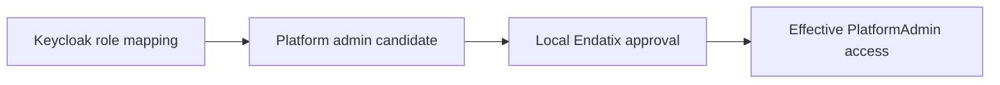

# Platform Administrators

Platform administrators manage Endatix at the application level. This is different from tenant-level administration, which only affects one organization or tenant.

Use platform administrator access carefully. It can expose platform-wide configuration and cross-tenant operational views.

## Platform vs Tenant Administration

Platform administration is for settings that affect the Endatix installation itself:

- Tenants and platform-wide tenant visibility
- Platform administrators
- Storage, email, and authentication configuration status
- Other platform-level operational settings

Tenant administration is for settings scoped to one organization:

- Users and roles inside the tenant
- Organization form behavior
- Tenant storage statistics
- Personal account security

If a setting affects one organization, use **Settings**. If it affects the whole Endatix installation, use **Platform Admin**.

## How Platform Admin Approval Works

Endatix uses local approval for platform administrator access. The approval record is a local assignment of the system `PlatformAdmin` role to the user.

External identity providers, such as Keycloak, can nominate users for platform administrator access, but they do not grant access by themselves.

This means:

- A mapped external role can make a user appear as a candidate.
- A current platform administrator must approve the user in Endatix.
- Endatix stores approval as a local `PlatformAdmin` role assignment.
- Removing approval in Endatix does not remove the user's role in Keycloak.

## Approving a Platform Administrator

1. Sign in as a current platform administrator.
2. Go to **Platform Admin**.
3. Open **Platform Admins**.
4. Review the **Candidates** list.
5. Choose **Grant** for the user who should receive platform administrator access.

Users nominated by an external provider may show an **IdP requested** or provider-specific badge. This means the external provider mapped the user to `PlatformAdmin`, but Endatix still requires local approval.

## Revoking Access

To remove platform administrator access, choose **Revoke** for that user in **Platform Admins**.

Revocation removes the local Endatix approval only. If the user still has a platform administrator role in Keycloak, they can appear as a candidate again, but they will not regain platform access until approved again in Endatix.

## Safety Rules

Endatix prevents unsafe platform administrator changes:

- You cannot revoke your own platform administrator access.
- You cannot remove the last active platform administrator.
- Tenant user management cannot assign or remove the system `PlatformAdmin` role.
- External provider roles are read-only from tenant user management.

These rules ensure there is always a local, auditable approval step for platform-wide access.
