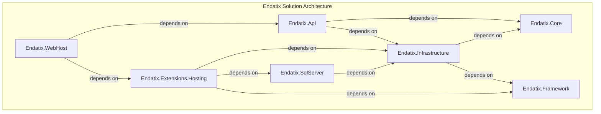

# Design and Architecture

## Dependencies

The code base consists of .NET projects having the following brief descriptions and internal dependencies:

* **Endatix.Api** - the web API endpoints. Depends on Endatix.Core and Endatix.Infrastructure
* **Endatix.Core** - the core application domain - entities, aggregate roots, domain events, use cases, etc. No dependencies
* **Endatix.Framework** - core framework project to expose common customization and extensibility points. To be used by all modules. No dependencies
* **Endatix.Extensions.Hosting** - Easy to use utilities for web hosting Endantix. Depends on Endatix.Framework, Endatix.Infrastructure & Endatix.SqlServer
* **Endatix.Infrastructure** - main implementations of the Core project. Deals with 3rd party integrations. Depends on Endatix.Core & Endatix.Framework
* **Endatix.SqlServer**   - implementation of MS SQL specific database logic. Depends on Endatix.Infrastructure
* **Endatix.WebHost**  - default app host project. Has zero code. Shows how endatix can be hosted and is used for debugging and testing the application. Depends on Endatix.Extensions.Hosting & Endatix.Api

## High Level Architecture

