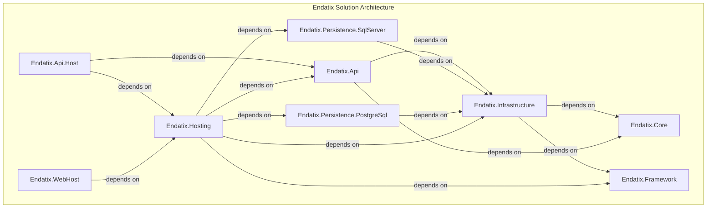

# Design and Architecture

## Dependencies

The code base consists of .NET projects having the following brief descriptions and internal dependencies:

* **Endatix.Core** - The core application domain - entities, aggregate roots, domain events, use cases, etc. No dependencies
* **Endatix.Framework** - Core framework project to expose common customization and extensibility points. To be used by all modules. No dependencies
* **Endatix.Infrastructure** - Main implementations of the Core project. Deals with 3rd party integrations. Depends on Endatix.Core & Endatix.Framework
* **Endatix.Api** - The web API endpoints. Depends on Endatix.Core and Endatix.Infrastructure
* **Endatix.Api.Host** - A lightweight API host package that sets up a proper API environment. Depends on Endatix.Api and Endatix.Hosting
* **Endatix.Persistence.SqlServer** - Implementation of MS SQL specific database logic. Depends on Endatix.Infrastructure
* **Endatix.Persistence.PostgreSql** - Implementation of PostgreSQL specific database logic. Depends on Endatix.Infrastructure
* **Endatix.Hosting** - Main hosting infrastructure package that bootstraps the application with proper configuration. Depends on Endatix.Framework, Endatix.Infrastructure, Endatix.Api, Endatix.Persistence.SqlServer and Endatix.Persistence.PostgreSql
* **Endatix.WebHost** - Default app host project with minimal code. Shows how Endatix can be hosted and is used for debugging and testing the application. Depends on Endatix.Hosting

## High Level Architecture

