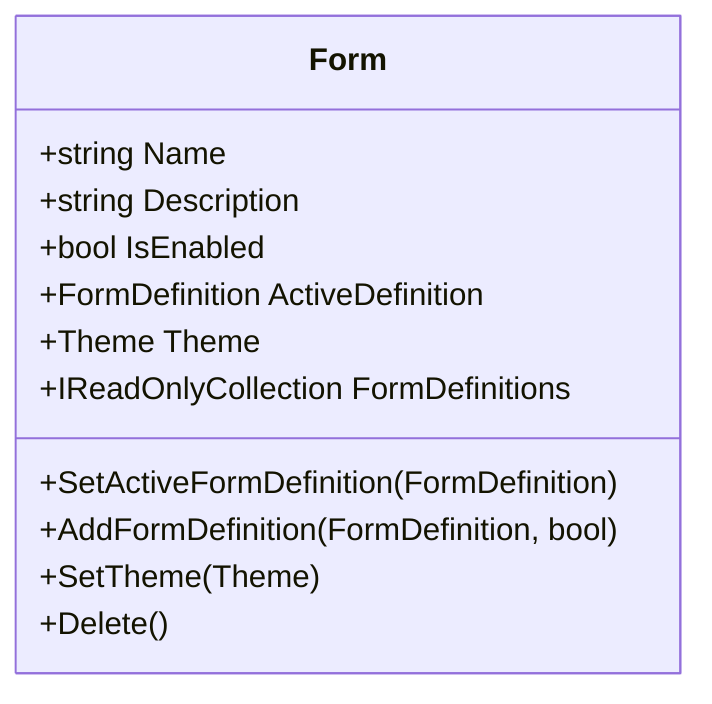
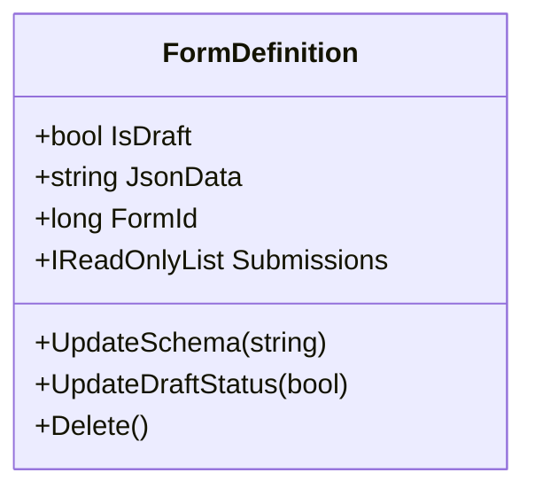
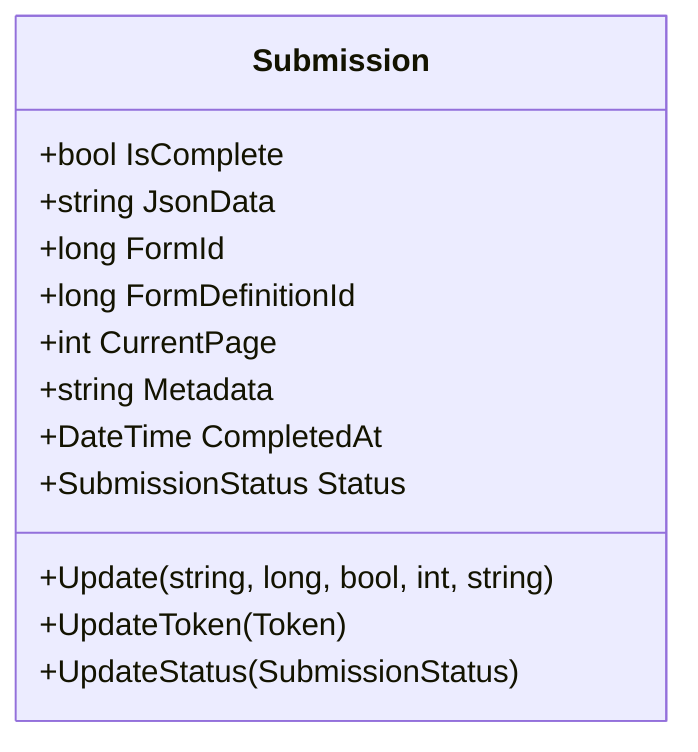
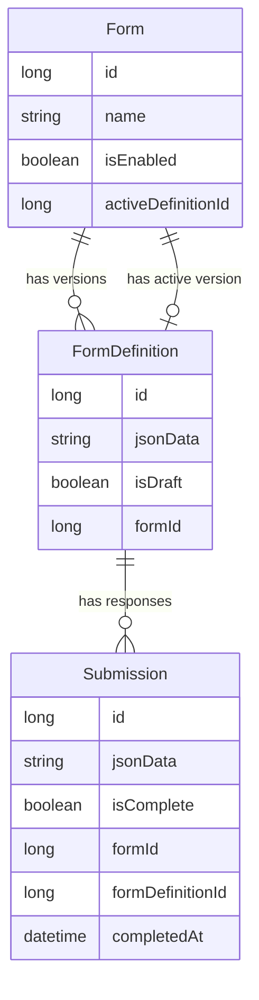

import useBaseUrl from "@docusaurus/useBaseUrl";
import ThemedImage from "@theme/ThemedImage";

# Design and Architecture

## High Level Architecture

Endatix is designed as an evolving solution that continues to adapt to meet the needs of modern application development. The architecture shown below represents the direction in which we're evolving the platform. Our API-first approach is designed to power various clients including web applications, mobile apps, kiosks, and third-party integrations.

The architecture emphasizes flexibility through a modular design with clear separation of concerns. Key components include identity management, distributed caching, message brokering, and support for multiple database technologies, allowing you to choose the hosting and persistence layer that best fits your needs. As of this time, we haven't implemented all of the components shown in the diagram, but we will be adding them in the future.

<ThemedImage
  alt="Solution architecture diagram"
  style={{ 
    transform: "zoom(1.1)",
    maxWidth: "100%",
    overflow: "hidden"
  }}
  sources={{
    light: useBaseUrl("/img/diagram/solution_architecture_light.jpg"),
    dark: useBaseUrl("/img/diagram/solution_architecture_dark.jpg"),
  }}
/>

## Domain Model

At the core of Endatix is a domain model focused on managing the form lifecycle from creation through submission. Of course, there are other entities in the solution, but the following are the 3 key entities that make up the form aggregate root.

### Key Entities

#### Form

The `Form` entity represents the container for a form or survey. It can be thought of as the top-level entity that users create when they want to collect data. It's a wrapper around the `FormDefinition` entity used to manage the form's lifecycle.

Key characteristics:
- A form has a name, description, and enabled/disabled status
- Forms can have multiple versions (FormDefinitions)
- Only one FormDefinition can be active at a time
- Forms can have an optional theme for styling
- Forms belong to a specific tenant (multi-tenancy support)

#### FormDefinition

The `FormDefinition` entity represents a specific version of a form's schema and structure based on the SurveyJS JSON Schema. This allows for versioning of forms, with the ability to update the form's structure without affecting existing submissions.

Key characteristics:
- Contains the actual form structure as JSON data
- Can be in draft status before publishing
- Is associated with a specific form
- Has a collection of submissions made against this specific version
- Supports soft deletion that cascades to submissions

#### Submission

The `Submission` entity represents a response to a form. Each submission is associated with a specific form definition, capturing the data provided by a user and the specific form definition it was created against. This allows for versioning of forms, with the ability to update the form's structure without affecting existing submissions.

Key characteristics:
- Contains the submitted data as JSON
- Tracks completion status and completion date
- Supports partial submissions with current page tracking
- Has a status to track the submission's lifecycle (New, Processing, Completed, etc.)
- Includes optional metadata for additional context
- References both the form and the specific form definition it was created against

### Entity Relationships

The relationships between these entities form the backbone of the form management lifecycle:

This domain model supports the complete form lifecycle:
1. Create a form with basic details
2. Define the form structure with a form definition 
3. Publish the form by setting a definition as active
4. Collect submissions against the published definition
5. Create new versions of the form while preserving existing submissions

The model is designed to ensure data integrity while providing flexibility for form evolution over time.

## .NET Solution Structure

The .NET codebase follows the Clean Architecture principles and is organized into the following projects:

- **Endatix.Core** - The core application domain - entities, aggregate roots, domain events, use cases, etc. No dependencies
- **Endatix.Framework** - Core framework project to expose common customization and extensibility points. To be used by all modules. No dependencies
- **Endatix.Infrastructure** - Main implementations of the Core project. Deals with 3rd party integrations. Depends on Endatix.Core & Endatix.Framework
- **Endatix.Api** - The web API endpoints. Depends on Endatix.Core and Endatix.Infrastructure
- **Endatix.Api.Host** - A lightweight API host package that sets up a proper API environment. Depends on Endatix.Api and Endatix.Hosting
- **Endatix.Persistence.SqlServer** - Implementation of MS SQL specific database logic. Depends on Endatix.Infrastructure
- **Endatix.Persistence.PostgreSql** - Implementation of PostgreSQL specific database logic. Depends on Endatix.Infrastructure
- **Endatix.Hosting** - Main hosting infrastructure package that bootstraps the application with proper configuration. Depends on Endatix.Framework, Endatix.Infrastructure, Endatix.Api, Endatix.Persistence.SqlServer and Endatix.Persistence.PostgreSql
- **Endatix.WebHost** - Default app host project with minimal code. Shows how Endatix can be hosted and is used for debugging and testing the application. Depends on Endatix.Hosting

:::info Note on Architecture

While Endatix is built on Clean Architecture principles, we are also incorporating elements of Vertical Slice Architecture to enhance development efficiency and modularity. This hybrid approach:

- **Organizes code by feature** rather than technical concerns, making it easier to understand and maintain
- **Reduces coupling** between different parts of the application
- **Simplifies development** by keeping related code together
- **Improves testability** by focusing on complete feature slices
- **Enables independent evolution** of different features

This architectural evolution allows us to maintain the benefits of Clean Architecture's separation of concerns while gaining the practical advantages of feature-focused development. As we iterate on the software architecture, we continue to refine this approach to best serve the needs of both developers and users.

:::

