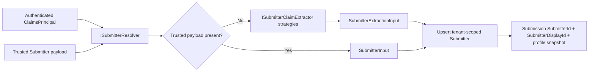

# Collecting Submitters Data

Endatix links identified form respondents to a dedicated `Submitter` record. This cleanly separates external respondent identities (like survey panelists) from your internal Hub operators.

When a user is resolved from authenticated claims or a trusted integration payload, Endatix records their submitter data alongside the submission. The submission stores a stable `SubmitterId`, a `SubmitterDisplayId`, and an immutable snapshot of the configured submitter profile fields, powering your grids, filters, and exports. Anonymous submissions can still be accepted, but they do not persist a submitter record.

## How submitter resolution works

When a submission is created, Endatix resolves the respondent's identity from one of two trusted sources:

1. The authenticated `ClaimsPrincipal` for normal public form and Hub flows.
2. An explicit `Submitter` payload sent to the protected "create on behalf" API for trusted integrations.



Endatix provides built-in extractors for common scenarios:

* **Keycloak:** Matches the external subject claim (`sub`) and configured display IDs.
* **Endatix JWT:** Links the submitter to the Hub operator's `AppUserId`.
* **Anonymous:** Processes the submission without persisting a submitter record.

The default resolver upserts a tenant-scoped `Submitter` by provider identity (`AuthProvider` + `ExternalSubjectId`) or Endatix `AppUserId`, refreshes its display/profile data, and stores the submission-time profile snapshot on the new submission.

## Configuration

For most deployments, you can configure submitter identity mapping directly in your `appsettings.json`.

```json
{
  "Endatix": {
    "Submitter": {
      "DisplayIdClaimTypes": ["panelistId", "preferred_username"],
      "ProfileSnapshotFields": ["email", "given_name"]
    }
  }
}

```

### DisplayIdClaimTypes

Endatix evaluates this ordered list and uses the first non-empty claim value as the submitter's display ID. In the example above, Endatix looks for `panelistId` first, falling back to `preferred_username` if missing.

### ProfileSnapshotFields

Controls which claims are copied into the submitter's rolling profile JSON, snapshotted at submission time, and exposed for profile filtering. Claim names are matched exactly, so `email`, `Email`, and `emails.primary` are different fields. Because these claims often contain Personally Identifiable Information (PII), keep this list intentionally small and limited to what you need for downstream workflows.

* **Immutability:** Snapshots ensure historical accuracy. If a submitter changes their email later, past submissions retain the email they used at the time of submission.
* **Filtering:** You can filter the Hub and API using the `submitterProfile.<field>:<value>` grammar (e.g., `submitterProfile.email:respondent@example.com`).

The same `ProfileSnapshotFields` allow-list is used for authenticated claims and trusted on-behalf payloads. If a field is not configured here, it is not copied into the submission snapshot.

### Hub grid profile columns

`ProfileSnapshotFields` controls what the API stores. Hub controls which stored profile fields appear as grid columns through the `NEXT_PUBLIC_SUBMITTER_GRID_PROFILE_FIELDS` environment variable.

For example, to store `email` in the snapshot and display it as a Hub grid column:

```bash
NEXT_PUBLIC_SUBMITTER_GRID_PROFILE_FIELDS=email
```

The submitter display ID is already a built-in system column (`SubmitterDisplayId`) and does not need to be repeated in `NEXT_PUBLIC_SUBMITTER_GRID_PROFILE_FIELDS`. You can customize the primary display ID filter placeholder with:

```bash
NEXT_PUBLIC_SUBMITTER_PRIMARY_FILTER_LABEL="Panelist ID"
```

## Recipe 1: Collect submitters from authenticated claims

Use this path when respondents authenticate before submitting a form. Configure which claims identify the respondent, then let Endatix resolve the submitter automatically.

1. Pick one stable claim for the primary display ID, such as `panelistId` or `preferred_username`.
2. Add only the profile fields you need for grid columns, filtering, exports, or downstream reconciliation.
3. Ensure your Identity Provider issues those exact claim names in the access token used by the public form.

Example:

```json
{
  "Endatix": {
    "Submitter": {
      "DisplayIdClaimTypes": ["panelistId", "preferred_username"],
      "ProfileSnapshotFields": ["email", "given_name", "family_name"]
    }
  }
}
```

For a common panel setup where `panelistId` should appear as the Display ID and `email` should appear in the submission grid profile data, keep `panelistId` in `DisplayIdClaimTypes` and `email` in `ProfileSnapshotFields`:

```json
{
  "Endatix": {
    "Submitter": {
      "DisplayIdClaimTypes": ["panelistId"],
      "ProfileSnapshotFields": ["email"]
    }
  }
}
```

Then configure Hub:

```bash
NEXT_PUBLIC_SUBMITTER_GRID_PROFILE_FIELDS=email
NEXT_PUBLIC_SUBMITTER_PRIMARY_FILTER_LABEL="Panelist ID"
```

At submission time, Endatix uses the first matching built-in extractor:

* `EndatixSubmitterClaimExtractor` for Endatix JWTs.
* `KeycloakSubmitterClaimExtractor` for external Keycloak subjects.
* `AnonymousSubmitterClaimExtractor` when no authenticated submitter can be resolved.

## Recipe 2: Create submissions on behalf of a submitter

Use this path for trusted server-to-server integrations, imports, panel-provider callbacks, or operator workflows where your backend already knows the respondent identity.

The endpoint is:

```http
POST /forms/{formId}/submissions/onbehalf
```

It is protected by the `Submissions.CreateOnBehalf` permission. Public clients should not call this endpoint directly.

The route value supplies `formId`. The request body extends the normal submission payload with an optional `submitter` object:

```json
{
  "isComplete": true,
  "currentPage": 0,
  "jsonData": "{\"question1\":\"answer\"}",
  "metadata": "{\"source\":\"panel-provider\"}",
  "submitter": {
    "externalSubjectId": "panel-user-7831",
    "displayId": "7831",
    "authProvider": "PanelProvider",
    "profile": {
      "email": "respondent@example.com",
      "given_name": "Alex",
      "country": "BG"
    }
  }
}
```

When `submitter` is present, `externalSubjectId` and `displayId` are required. `authProvider` is optional; if omitted, Endatix treats the payload as an `Integration` submitter. `appUserId` is also available for Endatix-owned users, but most external integrations should use `externalSubjectId`.

Resolution behavior:

* Endatix normalizes the trusted payload, then upserts a tenant-scoped `Submitter` by `AuthProvider` + `ExternalSubjectId`.
* `displayId` becomes the submission's `SubmitterDisplayId`.
* `profile` is filtered through `ProfileSnapshotFields` before it becomes `SubmitterProfileSnapshot`. The profile dictionary keys must match the configured field names exactly.
* The resulting submission response includes the same submitter fields used by Hub details, grids, filters, and exports.

Use this endpoint when the integration is already trusted. Do not accept submitter identity from an untrusted browser and forward it as-is.

## Recipe 3: Customize submitter extraction

Most customizations should add an `ISubmitterClaimExtractor`, not replace the whole resolver. A custom extractor is the right extension point when your authentication provider uses different claim names, multiple tenant-specific claim formats, or a non-Keycloak external provider.

```csharp
using System.Security.Claims;
using Endatix.Core.Abstractions.Submitters;

public sealed class PanelSubmitterClaimExtractor : ISubmitterClaimExtractor
{
    public int Priority => 50; // Run before the built-in extractors.

    public bool CanExtract(ClaimsPrincipal principal) =>
        principal.Identity?.IsAuthenticated == true &&
        principal.HasClaim(claim => claim.Type == "panel_subject");

    public SubmitterExtractionInput Extract(ClaimsPrincipal principal)
    {
        string subject = principal.FindFirst("panel_subject")!.Value;
        string displayId = principal.FindFirst("panelist_id")?.Value ?? subject;

        Dictionary<string, string> profile = new();
        AddIfPresent(profile, principal, "email");
        AddIfPresent(profile, principal, "country");

        return new SubmitterExtractionInput(
            AuthProvider: "PanelProvider",
            ExternalSubjectId: subject,
            DisplayId: displayId,
            AppUserId: null,
            Profile: profile);
    }

    private static void AddIfPresent(
        Dictionary<string, string> profile,
        ClaimsPrincipal principal,
        string claimType)
    {
        string? value = principal.FindFirst(claimType)?.Value;
        if (!string.IsNullOrWhiteSpace(value))
        {
            profile[claimType] = value;
        }
    }
}
```

Register it with your application services:

```csharp
builder.Services.AddScoped<ISubmitterClaimExtractor, PanelSubmitterClaimExtractor>();
```

Use a priority lower than the built-ins when your extractor should win. Built-in priorities are currently `100` for Endatix JWT, `150` for Keycloak, and `300` for anonymous.

### When to replace `ISubmitterResolver`

Replacing `ISubmitterResolver` is an advanced option. It is only needed if you want to change resolution semantics, such as loading profile data from an external CRM, mapping several external identities to one submitter, or changing how submitter records are upserted.

If you replace it, preserve these invariants:

* Keep submitters tenant-scoped.
* Return a stable `SubmitterId` when the same respondent submits again.
* Return a meaningful `DisplayId` for grids and support workflows.
* Return a profile snapshot that is safe to persist with the submission.
* Preserve the single-submission gate behavior for forms that limit one submission per submitter.

## Security Model

Submitter identity is strictly resolved from trusted server-side authentication state:

* **Zero Client Trust:** Public form submissions cannot inject submitter identities via the request body.
* **Claims-Driven:** Authenticated submitter data is derived solely from the cryptographically validated `ClaimsPrincipal`.
* **RBAC Protected:** "On-behalf" submissions use an explicit API path protected by Role-Based Access Control, requiring a trusted `Submitter` payload.
* **PII Minimization:** Profile data is limited entirely by your explicit `ProfileSnapshotFields` configuration.

## Migrating Legacy Submissions

To support zero-downtime upgrades, the system uses an Expand-Contract migration pattern. The new typed `SubmitterId` is the canonical reference, while the legacy `SubmittedBy` string column is maintained temporarily as a compatibility mirror.

**Recommended Rollout Strategy:**

1. **Schema Update:** Apply the additive migration. This adds the nullable `Submissions.SubmitterId` and `Submissions.SubmitterProfileSnapshot` columns, and converts submitter JSON columns to provider-native JSON (keeping `SubmittedBy` intact).
2. **Backfill Data:** Run the SQL script below to populate `SubmitterId` from existing `SubmittedBy` values.
3. **Normalize:** Normalize backfilled rows so `SubmittedBy` cleanly mirrors the new `SubmitterId`.
4. **Deprecate:** Once your application reads are fully migrated to `SubmitterId`, verify that no orphaned records remain, and drop the `SubmittedBy` column in a future release.

### PostgreSQL Backfill Script

```sql
-- A) SubmittedBy already matches a numeric Submitter.Id
UPDATE "Submissions" s
SET "SubmitterId" = CAST(s."SubmittedBy" AS bigint)
WHERE s."SubmitterId" IS NULL
  AND s."SubmittedBy" ~ '^[0-9]+$'
  AND EXISTS (
    SELECT 1
    FROM "Submitters" sub
    WHERE sub."Id" = CAST(s."SubmittedBy" AS bigint)
  );

-- B) Legacy Endatix rows: SubmittedBy matches AppUser.Id
UPDATE "Submissions" s
SET "SubmitterId" = sub."Id"
FROM "Submitters" sub
WHERE s."SubmitterId" IS NULL
  AND s."SubmittedBy" ~ '^[0-9]+$'
  AND sub."AuthProvider" = 'Endatix'
  AND sub."AppUserId" = CAST(s."SubmittedBy" AS bigint);

-- C) Legacy Keycloak rows: SubmittedBy matches an external subject GUID
UPDATE "Submissions" s
SET "SubmitterId" = sub."Id"
FROM "Submitters" sub
WHERE s."SubmitterId" IS NULL
  AND s."SubmittedBy" IS NOT NULL
  AND s."SubmittedBy" !~ '^[0-9]+$'
  AND sub."AuthProvider" = 'Keycloak'
  AND sub."ExternalSubjectId" = s."SubmittedBy";

-- D) Normalize the temporary mirror after backfill
UPDATE "Submissions"
SET "SubmittedBy" = "SubmitterId"::text
WHERE "SubmitterId" IS NOT NULL
  AND ("SubmittedBy" IS NULL OR "SubmittedBy" <> "SubmitterId"::text);

```

### Verification Step

Run this query before planning the final drop of the `SubmittedBy` column. It should return `0`.

```sql
SELECT COUNT(*)
FROM "Submissions"
WHERE "SubmitterId" IS NULL
  AND "SubmittedBy" IS NOT NULL;
```

*Performance Note: `submitterProfile.<field>` filters are PostgreSQL-only in the current MVP and use a GIN index on `SubmitterProfileSnapshot`. SQL Server profile filtering is deferred until computed-column indexes are designed for configured hot keys (e.g., email).*

## Related guides

- [External Authorization](/docs/guides/external-authorization)
- [Keycloak Authentication](/docs/building-your-solution/authentication/keycloak)
- [Form Prefilling](/docs/guides/form-prefilling)
