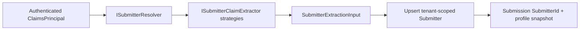

# Collecting Submitters Data

Endatix links form respondents to a dedicated `Submitter` record. This cleanly separates external respondent identities (like survey panelists) from your internal Hub operators. 

Whether a user logs in via an external Identity Provider (Keycloak, Google) or submits anonymously using a token, Endatix records their data alongside the submission. Each submission stores a stable `SubmitterId` and an immutable snapshot of the submitter's profile, powering your grids, filters, and exports.

## How submitter resolution works

When a submission is created, Endatix resolves the respondent's identity directly from the authenticated `ClaimsPrincipal`.



Endatix provides built-in extractors for common scenarios:

* **Keycloak:** Matches the external subject claim (`sub`) and configured display IDs.
* **Endatix JWT:** Links the submitter to the Hub operator's `AppUserId`.
* **Anonymous:** Processes the submission without persisting a submitter record.

## Configuration

For most deployments, you can configure submitter identity mapping directly in your `appsettings.json`.

```json
{
  "Endatix": {
    "Submitter": {
      "DisplayIdClaimTypes": ["panelistId", "preferred_username"],
      "ProfileSnapshotFields": ["email", "given_name"]
    }
  }
}

```

### DisplayIdClaimTypes

Endatix evaluates this ordered list and uses the first non-empty claim value as the submitter's display ID. In the example above, Endatix looks for `panelistId` first, falling back to `preferred_username` if missing.

### ProfileSnapshotFields

Controls which claims are copied into the submitter's rolling profile JSON, snapshotted at submission time, and exposed for profile filtering. Because these claims often contain Personal Identifiable Information (PII), keep this list intentionally small and limited to what you need for downstream workflows.

* **Immutability:** Snapshots ensure historical accuracy. If a submitter changes their email later, past submissions retain the email they used at the time of submission.
* **Filtering:** You can filter the Hub and API using the `submitterProfile.<field>:<value>` grammar (e.g., `submitterProfile.email:respondent@example.com`).

## Security Model

Submitter identity is strictly resolved from trusted server-side authentication state:

* **Zero Client Trust:** Public form submissions cannot inject submitter identities via the request body.
* **Claims-Driven:** Authenticated submitter data is derived solely from the cryptographically validated `ClaimsPrincipal`.
* **RBAC Protected:** "On-behalf" submissions use an explicit API path protected by Role-Based Access Control, requiring a trusted `Submitter` payload.
* **PII Minimization:** Profile data is limited entirely by your explicit `ProfileSnapshotFields` configuration.

## Migrating Legacy Submissions

To support zero-downtime upgrades, the system uses an Expand-Contract migration pattern. The new typed `SubmitterId` is the canonical reference, while the legacy `SubmittedBy` string column is maintained temporarily as a compatibility mirror.

**Recommended Rollout Strategy:**

1. **Schema Update:** Apply the additive migration. This adds the nullable `Submissions.SubmitterId` and `Submissions.SubmitterProfileSnapshot` columns, and converts submitter JSON columns to provider-native JSON (keeping `SubmittedBy` intact).
2. **Backfill Data:** Run the SQL script below to populate `SubmitterId` from existing `SubmittedBy` values.
3. **Normalize:** Normalize backfilled rows so `SubmittedBy` cleanly mirrors the new `SubmitterId`.
4. **Deprecate:** Once your application reads are fully migrated to `SubmitterId`, verify that no orphaned records remain, and drop the `SubmittedBy` column in a future release.

### PostgreSQL Backfill Script

```sql
-- A) SubmittedBy already matches a numeric Submitter.Id
UPDATE "Submissions" s
SET "SubmitterId" = CAST(s."SubmittedBy" AS bigint)
WHERE s."SubmitterId" IS NULL
  AND s."SubmittedBy" ~ '^[0-9]+$'
  AND EXISTS (
    SELECT 1
    FROM "Submitters" sub
    WHERE sub."Id" = CAST(s."SubmittedBy" AS bigint)
  );

-- B) Legacy Endatix rows: SubmittedBy matches AppUser.Id
UPDATE "Submissions" s
SET "SubmitterId" = sub."Id"
FROM "Submitters" sub
WHERE s."SubmitterId" IS NULL
  AND s."SubmittedBy" ~ '^[0-9]+$'
  AND sub."AuthProvider" = 'Endatix'
  AND sub."AppUserId" = CAST(s."SubmittedBy" AS bigint);

-- C) Legacy Keycloak rows: SubmittedBy matches an external subject GUID
UPDATE "Submissions" s
SET "SubmitterId" = sub."Id"
FROM "Submitters" sub
WHERE s."SubmitterId" IS NULL
  AND s."SubmittedBy" IS NOT NULL
  AND s."SubmittedBy" !~ '^[0-9]+$'
  AND sub."AuthProvider" = 'Keycloak'
  AND sub."ExternalSubjectId" = s."SubmittedBy";

-- D) Normalize the temporary mirror after backfill
UPDATE "Submissions"
SET "SubmittedBy" = "SubmitterId"::text
WHERE "SubmitterId" IS NOT NULL
  AND ("SubmittedBy" IS NULL OR "SubmittedBy" <> "SubmitterId"::text);

```

### Verification Step

Run this query before planning the final drop of the `SubmittedBy` column. It should return `0`.

```sql
SELECT COUNT(*)
FROM "Submissions"
WHERE "SubmitterId" IS NULL
  AND "SubmittedBy" IS NOT NULL;
```

*Performance Note: `submitterProfile.<field>` filters are PostgreSQL-only in the current MVP and use a GIN index on `SubmitterProfileSnapshot`. SQL Server profile filtering is deferred until computed-column indexes are designed for configured hot keys (e.g., email).*

## Related guides

- [External Authorization](/docs/guides/external-authorization)
- [Keycloak Authentication](/docs/building-your-solution/authentication/keycloak)
- [Form Prefilling](/docs/guides/form-prefilling)
